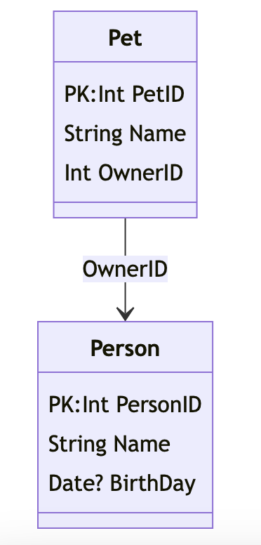

# dgenerate

**How it started?**
I had an idea to simplify data modelling: 
+ It should be as easy as possible ...
+ so there are no excuses not to do it. 

I believe *Conceptual Data Model* helps a lot to reason about a problem - image is worth a thousand words ... 

**How it works?**
Based on a very very very simple structure to define the data model (see table below) you get a Mermaid JS Class Diagram. 

**Why?** 
+ CSV is easier to understand/edit for non-programmers than Mermaid or PlantUML. 
+ Mermaid imports to Draw.IO like charm (and thats how its used in real life)

### Sample Data Model

| Table  | Column   | Type   | Key | NotNull | Comment                        | ReferenceTable | ReferenceColumn |
|--------|----------|--------|-----|---------|--------------------------------|----------------|-----------------|
| Person | PersonID | Int    | YES | YES     | unique Person ID               |                |                 |
| Person | Name     | String | NO  | YES     | name                           |                |                 |
| Person | BirthDay | Date   | NO  | NO      |                                |                |                 |
| Pet    | PetID    | Int    | YES | YES     | unique Pet ID                  |                |                 |
| Pet    | Name     | String | NO  | YES     | pet name (e.g. 'Rex')          |                |                 |
| Pet    | OwnerID  | Int    | NO  | YES     | reference to person owning that pet | Person    | PersonID        |

### Sample Diagram

### Its 99.9% AI assisted coding
See [instruction.md](instruction.md) to learn what Cursor Composer received as a prompt. Minimal corrections (also Cursor based) applied on top of it. 